# 🚀 Chatting & Conferencing (C&C) App  

---

## 🌍 Overview  

**Chatting & Conferencing (C&C) App** is a next-generation real-time communication platform that combines the messaging experience of modern chat applications with professional video conferencing capabilities.

This Final Year Project delivers:

- 📱 Real-time messaging  
- 📞 HD audio & video calls  
- 🎥 Unlimited meetings  
- 🎬 Meeting recording  
- 🌐 Cross-platform support (Android + Web)  
- 🔐 Secure encrypted authentication  
- ☁ Cloud-based scalable infrastructure  

---
## 📸 Screenshots

| Boarding Screen | Home Screen | Library Screen |
|-----------------|------------|----------------|
| 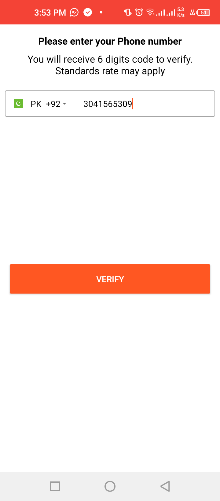 | 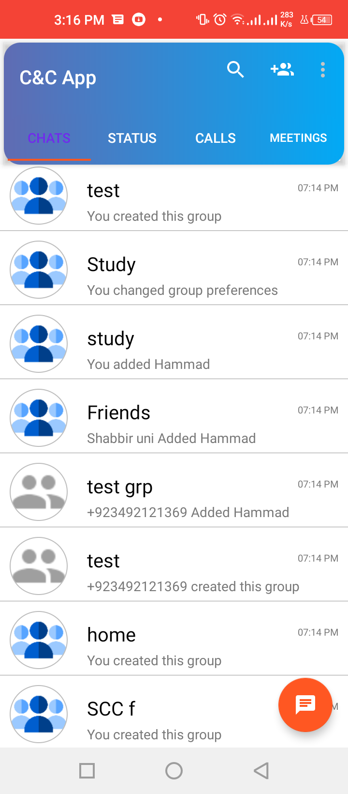 | 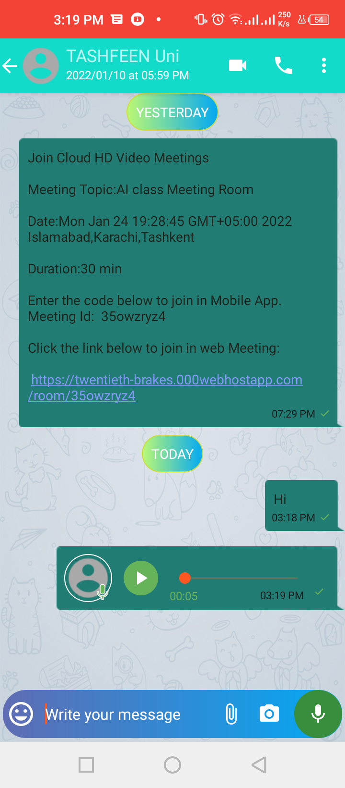 |

| Play Screen | Favorites Screen | Theme Screen |
|------------|----------------|--------------|
| 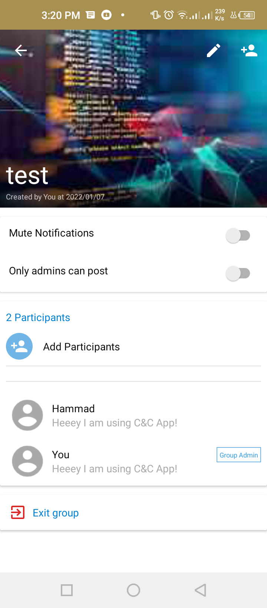 | 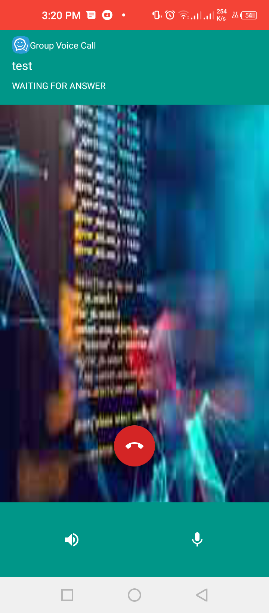 | 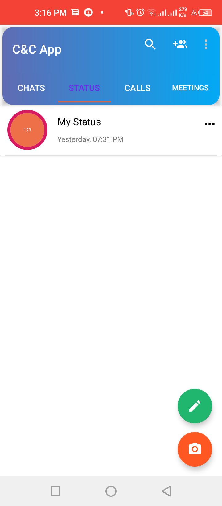 |

| Upnext Screen | Search Screen | Settings Screen |
|---------------|---------------|----------------|
| 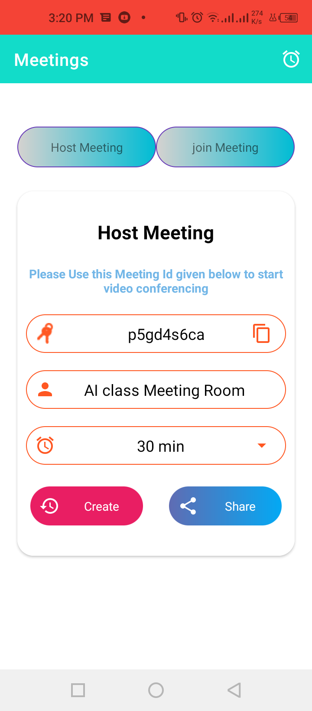 | 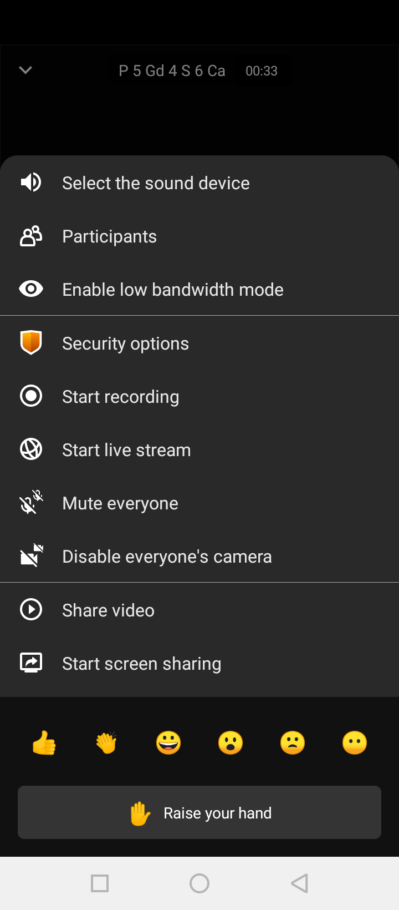 | 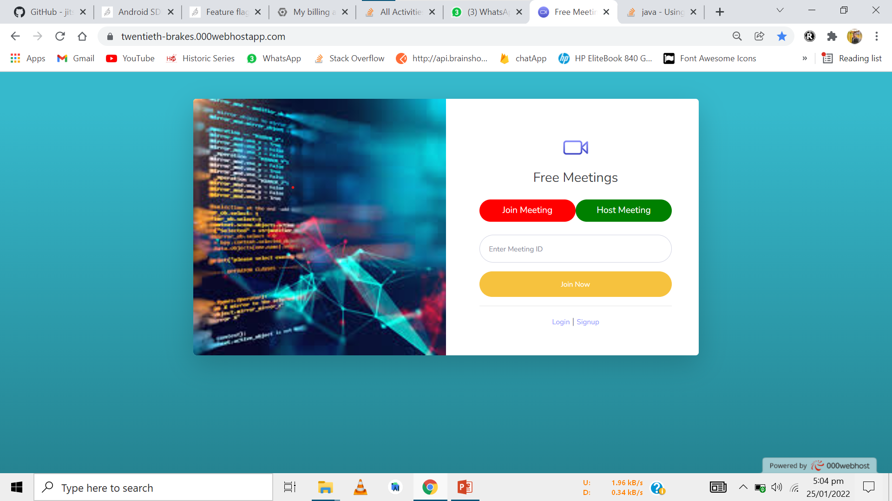 |

| Mini Player | Player Queue | Call Screen |
|-------------|--------------|------------|
| 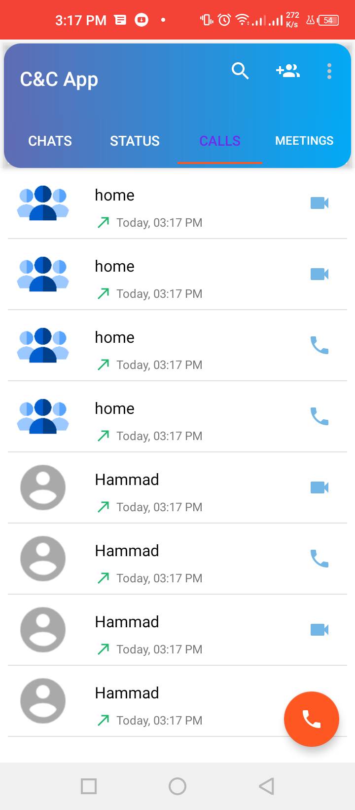 | 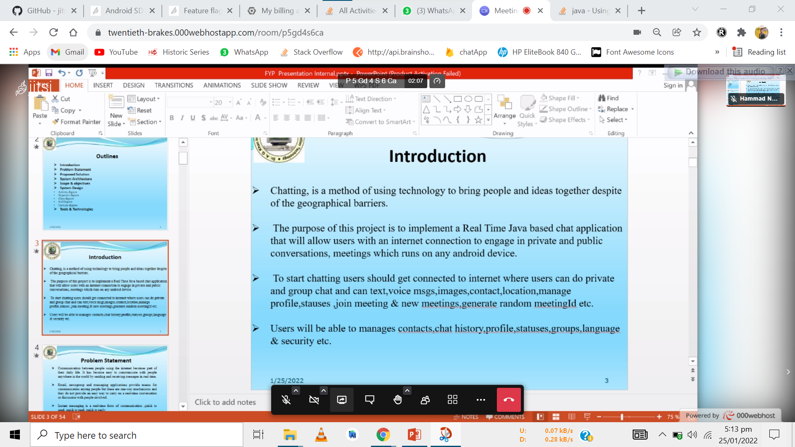 | 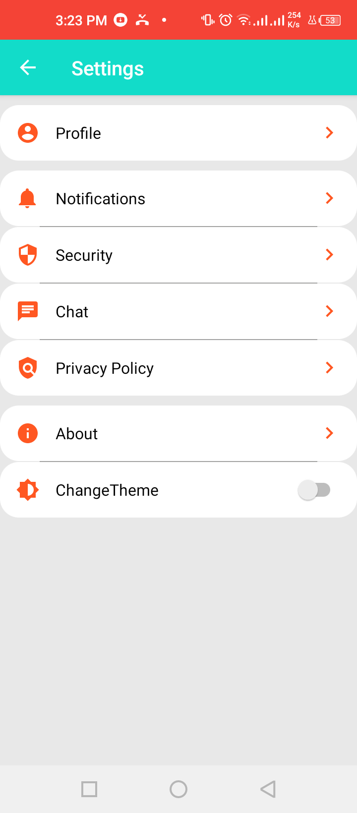 |

| Chat Screen | Notification Screen | Profile Screen |
|------------|--------------------|----------------|
| 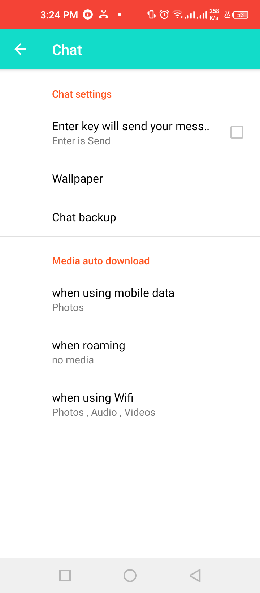 | 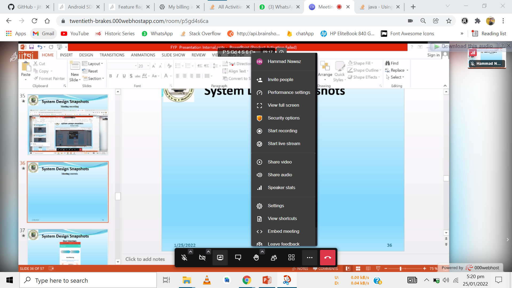 | 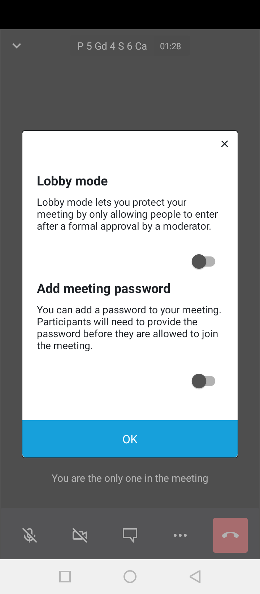 |

# ✨ Core Features  

---

## 💬 Advanced Messaging System  

- ✅ One-to-one real-time messaging  
- ✅ Group chats with admin controls  
- ✅ Media sharing (Images, Videos, Documents, Contacts)  
- ✅ Voice messages  
- ✅ Message delivery & read receipts  
- ✅ Online / Offline presence  
- ✅ Last seen tracking  
- ✅ Emoji support 😊  
- ✅ Push notifications  

---

## 👤 User Profile Management  

- Update profile information  
- Upload profile picture  
- Set custom status  
- View last seen & activity status  

---

## 📞 Audio & Video Calling  

- High-quality audio calls  
- HD video calls  
- Group calling support  
- Low-latency communication via Agora SDK  
- Optimized bandwidth handling  

---

# 🎥 Advanced Conferencing System  

### 🔹 Unlimited Meetings  
- No time restrictions  
- HD video & audio  
- Join via Android app or PC browser  

### 🔹 Host Controls  
- Mute / Unmute participants  
- Enable / Disable cameras  
- Remove participants  
- Participant management  

### 🔹 In-Meeting Collaboration  
- Screen sharing  
- Live chat room  
- Emoji reactions 🎉👏  
- Real-time participant monitoring  

### 🎬 Meeting Recording  

- Record live meetings  
- Secure cloud-based storage  
- Playback after meeting ends  
- Useful for education, business & training sessions  

---

# 🔐 Security & Encryption  

Security is a core foundation of C&C App.

- 🔐 OTP-based secure login  
- 🔐 Firebase Authentication  
- 🔐 MD5 hashing for data integrity  
- 🔐 SHA-256 encryption for secure data protection  
- 🔐 Secure cloud storage  
- 🔐 Protected meeting sessions  

---

# 🛠 Technology Stack  

## 🎨 Frontend  
- XML (Android UI Design)

## ⚙ Backend  
- Java  
- Kotlin  

## 🗄 Database  
- Firebase Realtime Database / Firestore  

## 📡 Real-Time Communication  
- Agora.io – Audio & Video Calls  
- Jitsi Meet SDK – Video Conferencing & Recording  

## 🔔 Notifications  
- OneSignal Push Notifications  

## ☁ Cloud Infrastructure  
- Google Cloud Platform  

---

# 🏗 System Architecture – Chatting & Conferencing (C&C) App

                        ┌──────────────────────────┐
                        │      Android Client      │
                        │  (XML UI - Java/Kotlin)  │
                        └──────────────┬───────────┘
                                       │
                                       │ HTTPS / WebSocket
                                       ▼
                        ┌──────────────────────────┐
                        │      Firebase Backend     │
                        │  • Authentication (OTP)   │
                        │  • Realtime Database      │
                        │  • Firestore Storage      │
                        └──────────────┬───────────┘
                                       │
             ┌─────────────────────────┼─────────────────────────┐
             │                         │                         │
             ▼                         ▼                         ▼
    ┌────────────────┐        ┌────────────────┐        ┌────────────────┐
    │   Agora SDK    │        │   Jitsi SDK    │        │   OneSignal    │
    │ (Audio/Video)  │        │ (Meetings +    │        │ Push Notifications │
    │                │        │  Recording)    │        │                │
    └────────────────┘        └────────────────┘        └────────────────┘
                                       │
                                       ▼
                        ┌──────────────────────────┐
                        │     Google Cloud         │
                        │ Infrastructure & Storage │
                        └──────────────────────────┘

# 🌟 Key Capabilities  

- Real-time cloud messaging  
- Cross-device synchronization  
- Unlimited meeting duration  
- Secure meeting recording  
- Encrypted authentication  
- Scalable cloud deployment  
- Production-ready architecture  

---

# 🎯 Project Objective  

To develop a scalable, secure, and modern communication platform that integrates:

- 📱 Advanced Messaging  
- 🎥 Professional Video Conferencing  
- 🔐 Strong Encryption  
- ☁ Cloud Infrastructure  

All within a unified application ecosystem.

---

# 👨‍💻 Developed By  

**Hammad Nawaz**  
Final Year Software Engineering Project  

       

